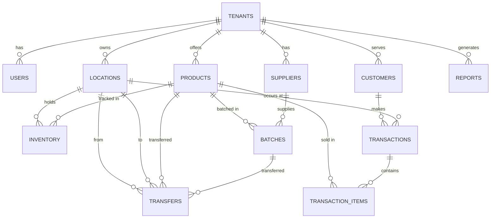

# ShopXperience Database Schema Design

## Overview
This document outlines the PostgreSQL database schema for ShopXperience, a multi-tenant point-of-sale system. The schema ensures tenant isolation by including a `tenant_id` foreign key in all tenant-specific tables. Normalization is applied to 3NF to reduce redundancy. Indexes are added on foreign keys and frequently queried fields for performance. The design supports scalability through proper partitioning and indexing strategies.

## Key Entities and Relationships
- **Tenants**: Core entity for multi-tenancy.
- **Users**: Associated with tenants, with roles.
- **Locations**: Store locations per tenant.
- **Products**: Items sold, per tenant.
- **Inventory**: Stock levels per product and location.
- **Suppliers**: Supplier profiles for procurement.
- **Batches**: Lot tracking for products with expiration dates.
- **Transfers**: Inventory transfers between locations.
- **Customers**: Buyer information per tenant.
- **Transactions**: Sales records linking customers, products, and locations.
- **Reports**: Configurations for analytics reports.

## Entity-Relationship Diagram (Mermaid)

## Table Structures

### 1. tenants
Stores information about each tenant (shop).

| Column | Type | Constraints | Description |
|--------|------|-------------|-------------|
| id | SERIAL | PRIMARY KEY | Unique tenant identifier |
| name | VARCHAR(255) | NOT NULL | Tenant name |
| domain | VARCHAR(255) | UNIQUE, NOT NULL | Unique domain for tenant |
| created_at | TIMESTAMP | DEFAULT NOW() | Creation timestamp |
| updated_at | TIMESTAMP | DEFAULT NOW() | Last update timestamp |

**Indexes**: PRIMARY KEY on id, UNIQUE on domain.

### 2. users
Users within tenants, with roles for access control.

| Column | Type | Constraints | Description |
|--------|------|-------------|-------------|
| id | SERIAL | PRIMARY KEY | Unique user identifier |
| tenant_id | INTEGER | NOT NULL, FOREIGN KEY REFERENCES tenants(id) | Tenant association |
| username | VARCHAR(255) | UNIQUE (tenant_id, username), NOT NULL | Username within tenant |
| email | VARCHAR(255) | UNIQUE, NOT NULL | User email |
| password_hash | VARCHAR(255) | NOT NULL | Hashed password |
| role | VARCHAR(50) | NOT NULL, CHECK (role IN ('admin', 'manager', 'cashier')) | User role |
| created_at | TIMESTAMP | DEFAULT NOW() | Creation timestamp |
| updated_at | TIMESTAMP | DEFAULT NOW() | Last update timestamp |

**Indexes**: PRIMARY KEY on id, FOREIGN KEY on tenant_id, UNIQUE on (tenant_id, username), INDEX on email.

### 3. locations
Store locations for each tenant.

| Column | Type | Constraints | Description |
|--------|------|-------------|-------------|
| id | SERIAL | PRIMARY KEY | Unique location identifier |
| tenant_id | INTEGER | NOT NULL, FOREIGN KEY REFERENCES tenants(id) | Tenant association |
| name | VARCHAR(255) | NOT NULL | Location name |
| address | TEXT | NOT NULL | Full address |
| phone | VARCHAR(20) | | Contact phone |
| created_at | TIMESTAMP | DEFAULT NOW() | Creation timestamp |
| updated_at | TIMESTAMP | DEFAULT NOW() | Last update timestamp |

**Indexes**: PRIMARY KEY on id, FOREIGN KEY on tenant_id, INDEX on tenant_id.

### 4. products
Products offered by tenants.

| Column | Type | Constraints | Description |
|--------|------|-------------|-------------|
| id | SERIAL | PRIMARY KEY | Unique product identifier |
| tenant_id | INTEGER | NOT NULL, FOREIGN KEY REFERENCES tenants(id) | Tenant association |
| name | VARCHAR(255) | NOT NULL | Product name |
| description | TEXT | | Product description |
| sku | VARCHAR(100) | UNIQUE (tenant_id, sku), NOT NULL | Stock keeping unit |
| price | DECIMAL(10,2) | NOT NULL | Selling price |
| cost | DECIMAL(10,2) | | Cost price |
| category | VARCHAR(100) | | Product category |
| created_at | TIMESTAMP | DEFAULT NOW() | Creation timestamp |
| updated_at | TIMESTAMP | DEFAULT NOW() | Last update timestamp |

**Indexes**: PRIMARY KEY on id, FOREIGN KEY on tenant_id, UNIQUE on (tenant_id, sku), INDEX on category.

### 5. inventory
Stock levels for products at specific locations.

| Column | Type | Constraints | Description |
|--------|------|-------------|-------------|
| id | SERIAL | PRIMARY KEY | Unique inventory record |
| tenant_id | INTEGER | NOT NULL, FOREIGN KEY REFERENCES tenants(id) | Tenant association |
| product_id | INTEGER | NOT NULL, FOREIGN KEY REFERENCES products(id) | Product reference |
| location_id | INTEGER | NOT NULL, FOREIGN KEY REFERENCES locations(id) | Location reference |
| quantity | INTEGER | NOT NULL, DEFAULT 0 | Current stock quantity |
| min_stock | INTEGER | DEFAULT 0 | Minimum stock threshold |
| reorder_point | INTEGER | DEFAULT 0 | Reorder point threshold |
| updated_at | TIMESTAMP | DEFAULT NOW() | Last update timestamp |

**Indexes**: PRIMARY KEY on id, FOREIGN KEY on tenant_id, product_id, location_id, UNIQUE on (product_id, location_id), INDEX on quantity.

### 6. customers
Customer information per tenant.

| Column | Type | Constraints | Description |
|--------|------|-------------|-------------|
| id | SERIAL | PRIMARY KEY | Unique customer identifier |
| tenant_id | INTEGER | NOT NULL, FOREIGN KEY REFERENCES tenants(id) | Tenant association |
| first_name | VARCHAR(100) | NOT NULL | First name |
| last_name | VARCHAR(100) | NOT NULL | Last name |
| email | VARCHAR(255) | UNIQUE (tenant_id, email) | Email address |
| phone | VARCHAR(20) | | Phone number |
| address | TEXT | | Address |
| created_at | TIMESTAMP | DEFAULT NOW() | Creation timestamp |
| updated_at | TIMESTAMP | DEFAULT NOW() | Last update timestamp |

**Indexes**: PRIMARY KEY on id, FOREIGN KEY on tenant_id, UNIQUE on (tenant_id, email), INDEX on phone.

### 7. transactions
Sales transactions.

| Column | Type | Constraints | Description |
|--------|------|-------------|-------------|
| id | SERIAL | PRIMARY KEY | Unique transaction identifier |
| tenant_id | INTEGER | NOT NULL, FOREIGN KEY REFERENCES tenants(id) | Tenant association |
| customer_id | INTEGER | FOREIGN KEY REFERENCES customers(id) | Customer reference (nullable for anonymous) |
| location_id | INTEGER | NOT NULL, FOREIGN KEY REFERENCES locations(id) | Location of transaction |
| total_amount | DECIMAL(10,2) | NOT NULL | Total transaction amount |
| tax_amount | DECIMAL(10,2) | DEFAULT 0 | Tax amount |
| discount_amount | DECIMAL(10,2) | DEFAULT 0 | Discount amount |
| payment_method | VARCHAR(50) | NOT NULL | Payment method (cash, card, etc.) |
| status | VARCHAR(20) | NOT NULL, DEFAULT 'completed' | Transaction status |
| created_at | TIMESTAMP | DEFAULT NOW() | Transaction timestamp |

**Indexes**: PRIMARY KEY on id, FOREIGN KEY on tenant_id, customer_id, location_id, INDEX on created_at, status.

### 8. transaction_items
Line items for transactions (junction table for many-to-many between transactions and products).

| Column | Type | Constraints | Description |
|--------|------|-------------|-------------|
| id | SERIAL | PRIMARY KEY | Unique item identifier |
| transaction_id | INTEGER | NOT NULL, FOREIGN KEY REFERENCES transactions(id) | Transaction reference |
| product_id | INTEGER | NOT NULL, FOREIGN KEY REFERENCES products(id) | Product reference |
| quantity | INTEGER | NOT NULL | Quantity sold |
| unit_price | DECIMAL(10,2) | NOT NULL | Price per unit at time of sale |
| total_price | DECIMAL(10,2) | NOT NULL | Total for this item |

**Indexes**: PRIMARY KEY on id, FOREIGN KEY on transaction_id, product_id.

### 9. reports
Report configurations or generated reports for analytics.

| Column | Type | Constraints | Description |
|--------|------|-------------|-------------|
| id | SERIAL | PRIMARY KEY | Unique report identifier |
| tenant_id | INTEGER | NOT NULL, FOREIGN KEY REFERENCES tenants(id) | Tenant association |
| name | VARCHAR(255) | NOT NULL | Report name |
| type | VARCHAR(50) | NOT NULL | Report type (sales, inventory, etc.) |
| parameters | JSONB | | Report parameters |
| created_by | INTEGER | FOREIGN KEY REFERENCES users(id) | User who created |
| created_at | TIMESTAMP | DEFAULT NOW() | Creation timestamp |

**Indexes**: PRIMARY KEY on id, FOREIGN KEY on tenant_id, INDEX on type.

### 10. suppliers
Supplier profiles for procurement.

| Column | Type | Constraints | Description |
|--------|------|-------------|-------------|
| id | SERIAL | PRIMARY KEY | Unique supplier identifier |
| tenant_id | INTEGER | NOT NULL, FOREIGN KEY REFERENCES tenants(id) | Tenant association |
| name | VARCHAR(255) | NOT NULL | Supplier name |
| contact_name | VARCHAR(255) | | Contact person name |
| email | VARCHAR(255) | | Contact email |
| phone | VARCHAR(20) | | Contact phone |
| address | TEXT | | Supplier address |
| created_at | TIMESTAMP | DEFAULT NOW() | Creation timestamp |
| updated_at | TIMESTAMP | DEFAULT NOW() | Last update timestamp |

**Indexes**: PRIMARY KEY on id, FOREIGN KEY on tenant_id, UNIQUE on (tenant_id, name).

### 11. batches
Lot tracking for products with expiration dates.

| Column | Type | Constraints | Description |
|--------|------|-------------|-------------|
| id | SERIAL | PRIMARY KEY | Unique batch identifier |
| tenant_id | INTEGER | NOT NULL, FOREIGN KEY REFERENCES tenants(id) | Tenant association |
| product_id | INTEGER | NOT NULL, FOREIGN KEY REFERENCES products(id) | Product reference |
| supplier_id | INTEGER | FOREIGN KEY REFERENCES suppliers(id) | Supplier reference |
| batch_number | VARCHAR(100) | NOT NULL | Batch/lot number |
| quantity_received | INTEGER | NOT NULL | Quantity received in this batch |
| cost_per_unit | DECIMAL(10,2) | NOT NULL | Cost per unit for this batch |
| expiration_date | DATE | | Expiration date |
| received_date | DATE | DEFAULT NOW() | Date batch was received |
| created_at | TIMESTAMP | DEFAULT NOW() | Creation timestamp |
| updated_at | TIMESTAMP | DEFAULT NOW() | Last update timestamp |

**Indexes**: PRIMARY KEY on id, FOREIGN KEY on tenant_id, product_id, supplier_id, UNIQUE on (tenant_id, product_id, batch_number).

### 12. transfers
Inventory transfers between locations.

| Column | Type | Constraints | Description |
|--------|------|-------------|-------------|
| id | SERIAL | PRIMARY KEY | Unique transfer identifier |
| tenant_id | INTEGER | NOT NULL, FOREIGN KEY REFERENCES tenants(id) | Tenant association |
| from_location_id | INTEGER | NOT NULL, FOREIGN KEY REFERENCES locations(id) | Source location |
| to_location_id | INTEGER | NOT NULL, FOREIGN KEY REFERENCES locations(id) | Destination location |
| product_id | INTEGER | NOT NULL, FOREIGN KEY REFERENCES products(id) | Product being transferred |
| batch_id | INTEGER | FOREIGN KEY REFERENCES batches(id) | Batch being transferred |
| quantity | INTEGER | NOT NULL | Quantity transferred |
| transfer_date | DATE | DEFAULT NOW() | Date of transfer |
| status | ENUM('pending', 'completed', 'cancelled') | DEFAULT 'pending' | Transfer status |
| notes | TEXT | | Additional notes |
| created_at | TIMESTAMP | DEFAULT NOW() | Creation timestamp |
| updated_at | TIMESTAMP | DEFAULT NOW() | Last update timestamp |

**Indexes**: PRIMARY KEY on id, FOREIGN KEY on tenant_id, from_location_id, to_location_id, product_id, batch_id, INDEX on (tenant_id, status).

## Normalization and Relationships
- All tables are in 3NF: No transitive dependencies, all non-key attributes depend only on the primary key.
- Multi-tenant isolation: tenant_id ensures data separation.
- Foreign keys enforce referential integrity.
- Junction table (transaction_items) handles many-to-many between transactions and products.

## Performance and Scalability
- Indexes on all foreign keys and commonly queried fields (e.g., timestamps, status).
- Partitioning can be applied to large tables like transactions and transaction_items by tenant_id or date.
- Use PostgreSQL features like partial indexes for active records.

## Additional Considerations
- Audit logging can be added via triggers on update/delete operations.
- Soft deletes can be implemented with a deleted_at column if needed.
- For high scalability, consider read replicas and sharding by tenant_id.