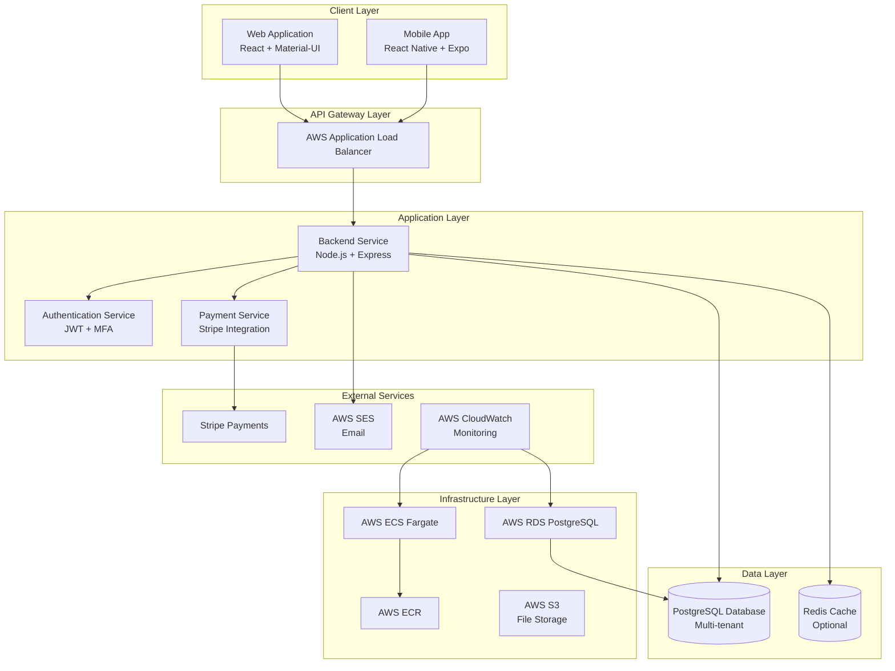
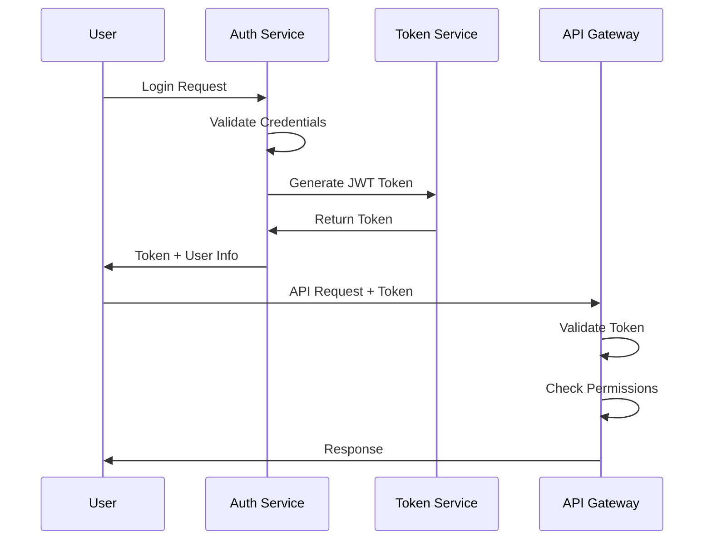
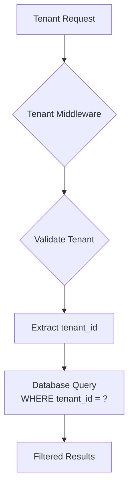
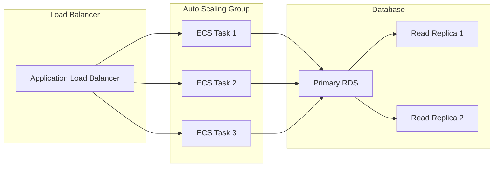
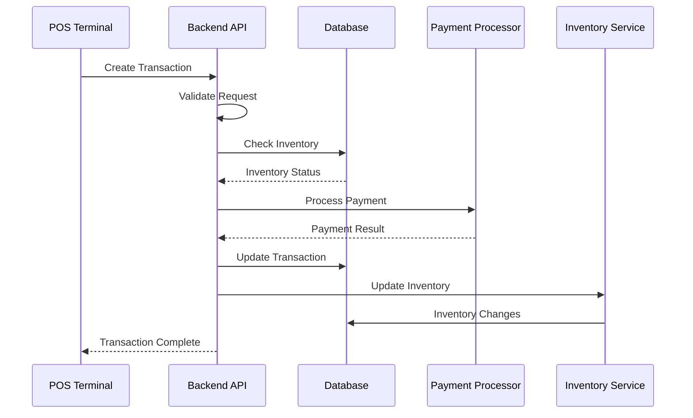
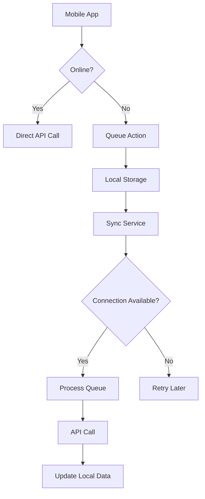
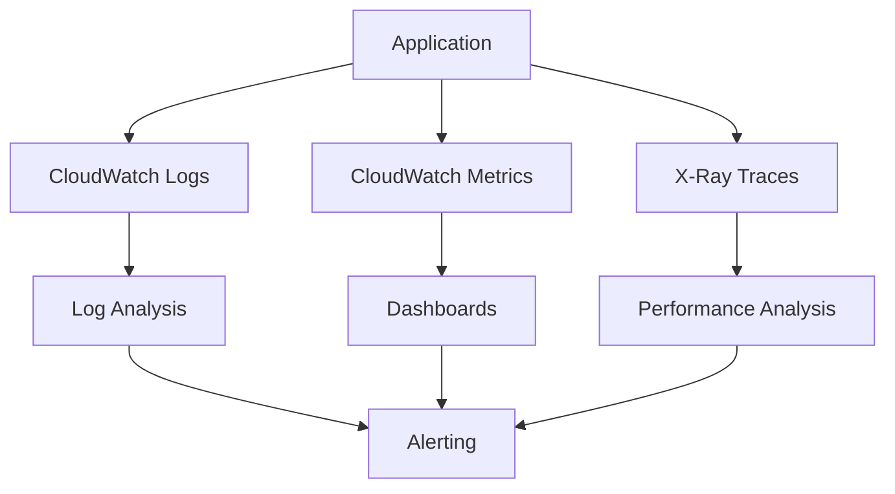
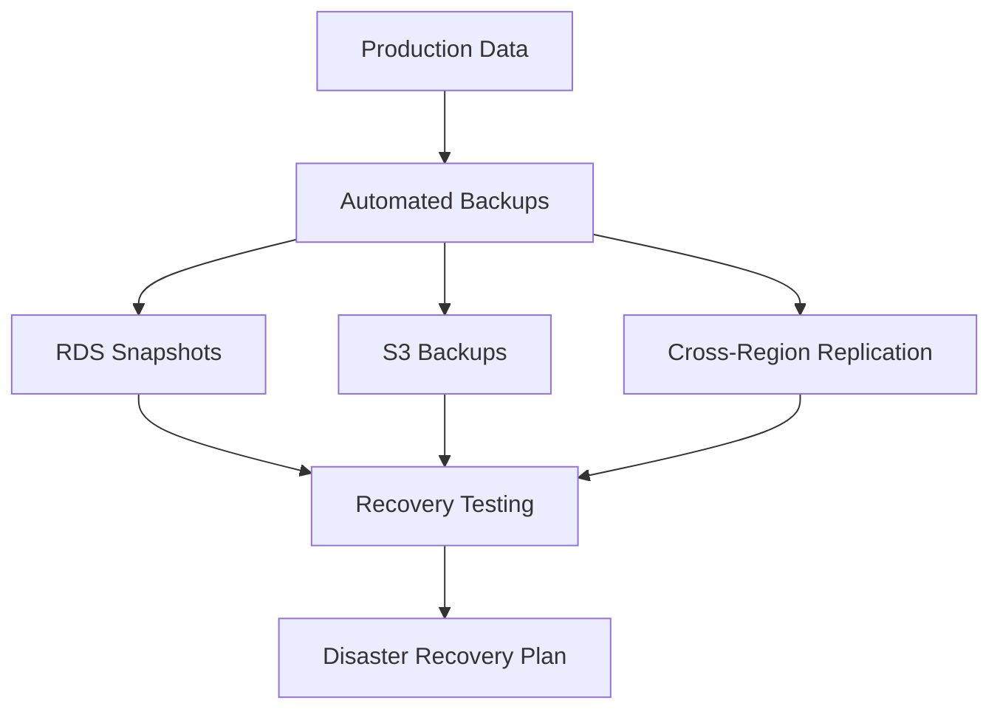

# ShopXperience System Architecture

## Overview

ShopXperience is a multi-tenant, cloud-native point-of-sale (POS) system designed for retail businesses. The architecture follows microservices principles with a modular design that supports scalability, maintainability, and extensibility.

## High-Level Architecture

## Component Architecture

### Client Applications

#### Web Application
- **Technology**: React 18, Material-UI, React Router
- **Features**:
  - Responsive dashboard with real-time analytics
  - Point-of-sale interface
  - Inventory management
  - Customer relationship management
  - Reporting and analytics
- **Deployment**: Nginx container served via ECS

#### Mobile Application
- **Technology**: React Native, Expo
- **Features**:
  - Offline-capable POS operations
  - Barcode scanning
  - Real-time inventory sync
  - Customer management
  - Basic reporting
- **Deployment**: App Store and Google Play

### Backend Services

#### API Server
- **Technology**: Node.js, Express.js
- **Responsibilities**:
  - RESTful API endpoints
  - Business logic processing
  - Data validation and sanitization
  - Authentication and authorization
  - Multi-tenancy enforcement

#### Authentication Service
- **Features**:
  - JWT token-based authentication
  - Multi-factor authentication (MFA)
  - Role-based access control (RBAC)
  - Session management

#### Payment Processing
- **Integration**: Stripe API
- **Features**:
  - Secure payment processing
  - PCI DSS compliance
  - Multiple payment methods
  - Refund processing
  - Transaction reconciliation

### Data Architecture

#### Database Design
- **Technology**: PostgreSQL 15
- **Architecture**: Multi-tenant with tenant isolation
- **Features**:
  - ACID compliance
  - JSONB for flexible data storage
  - Full-text search capabilities
  - Partitioning for large tables

#### Caching Strategy
- **Technology**: Redis (optional)
- **Usage**:
  - Session storage
  - API response caching
  - Rate limiting data
  - Temporary data storage

### Infrastructure Architecture

#### Cloud Infrastructure (AWS)
- **Compute**: ECS Fargate for container orchestration
- **Database**: RDS PostgreSQL with Multi-AZ deployment
- **Storage**: S3 for file storage, ECR for container images
- **Networking**: VPC with public/private subnets, ALB for load balancing
- **Security**: Security groups, IAM roles, Secrets Manager

#### Containerization
- **Technology**: Docker
- **Benefits**:
  - Consistent deployment across environments
  - Isolation and security
  - Easy scaling and rollback
  - Dependency management

## Security Architecture

### Authentication & Authorization

#### Security Layers
1. **Network Security**:
   - VPC isolation
   - Security groups with minimal access
   - SSL/TLS encryption in transit

2. **Application Security**:
   - Input validation and sanitization
   - Rate limiting
   - CORS configuration
   - Security headers (Helmet.js)

3. **Data Security**:
   - Encrypted data at rest
   - Secure credential management
   - Audit logging
   - GDPR/CCPA compliance

### Multi-Tenancy Implementation

- **Tenant Identification**: Via JWT token payload
- **Data Isolation**: Row-level security with tenant_id
- **Resource Sharing**: Shared infrastructure with logical separation

## Scalability Architecture

### Horizontal Scaling

#### Scaling Strategies
- **Application Layer**: ECS auto-scaling based on CPU/memory
- **Database Layer**: Read replicas for read-heavy workloads
- **Caching Layer**: Redis cluster for high availability
- **CDN**: CloudFront for static asset delivery

### Performance Optimization

#### Database Optimization
- **Indexing**: Strategic indexes on frequently queried columns
- **Partitioning**: Table partitioning by tenant_id or date
- **Connection Pooling**: Efficient database connection management
- **Query Optimization**: EXPLAIN analysis and optimization

#### Application Optimization
- **Caching**: Multi-level caching strategy
- **Async Processing**: Background job processing
- **CDN Integration**: Static asset optimization
- **API Optimization**: GraphQL for flexible data fetching

## Data Flow Architecture

### Transaction Processing Flow

### Real-time Synchronization

## Monitoring and Observability

### Application Monitoring

#### Monitoring Components
- **Application Metrics**: Response times, error rates, throughput
- **Infrastructure Metrics**: CPU, memory, disk usage
- **Business Metrics**: Transaction volume, user activity
- **Custom Metrics**: Application-specific KPIs

### Logging Strategy

- **Application Logs**: Structured logging with Winston
- **Access Logs**: ALB and application access logs
- **Error Logs**: Centralized error tracking
- **Audit Logs**: Security and compliance logging

## Disaster Recovery

### Backup Strategy

- **Database Backups**: Automated RDS snapshots
- **Application Backups**: Container images in ECR
- **Configuration Backups**: Infrastructure as code
- **Cross-Region Replication**: Multi-region disaster recovery

### Recovery Procedures

1. **Application Failure**: Auto-scaling replaces unhealthy instances
2. **Database Failure**: Failover to standby replica
3. **Region Failure**: Cross-region failover with Route 53
4. **Data Corruption**: Point-in-time recovery from backups

## Technology Stack Summary

| Component | Technology | Version | Purpose |
|-----------|------------|---------|---------|
| Frontend Web | React | 18.x | User interface |
| Frontend Mobile | React Native | Latest | Mobile application |
| Backend API | Node.js + Express | 18.x | RESTful API server |
| Database | PostgreSQL | 15.x | Primary data store |
| Cache | Redis | Latest | Session and data caching |
| Payment | Stripe | API | Payment processing |
| Infrastructure | AWS ECS | Fargate | Container orchestration |
| Load Balancer | AWS ALB | - | Traffic distribution |
| Monitoring | AWS CloudWatch | - | Observability |
| CI/CD | GitHub Actions | - | Automated deployment |

## Performance Characteristics

### Target Metrics
- **Response Time**: <200ms for API calls
- **Availability**: 99.9% uptime SLA
- **Concurrent Users**: 1000+ simultaneous users
- **Transaction Volume**: 10,000+ transactions/hour

### Performance Optimization Techniques
- **Database Indexing**: Optimized queries with proper indexing
- **Caching Layers**: Multi-level caching strategy
- **CDN Integration**: Global content delivery
- **Async Processing**: Background job queues
- **Horizontal Scaling**: Auto-scaling based on load

## Future Architecture Considerations

### Microservices Evolution
- **Service Decomposition**: Split monolithic backend into microservices
- **API Gateway**: Implement dedicated API gateway
- **Service Mesh**: Istio for service-to-service communication
- **Event-Driven Architecture**: Event sourcing for complex workflows

### Advanced Features
- **Machine Learning**: Predictive analytics and recommendations
- **IoT Integration**: Connected devices and sensors
- **Blockchain**: Supply chain transparency
- **Edge Computing**: Local processing for retail locations

### Scalability Enhancements
- **Global Distribution**: Multi-region deployment
- **Serverless Components**: Lambda functions for specific workloads
- **Advanced Caching**: CloudFront with Lambda@Edge
- **Database Sharding**: Horizontal database scaling

---

This architecture document provides a comprehensive overview of the ShopXperience system design. For implementation details, refer to the specific component documentation and setup guides.